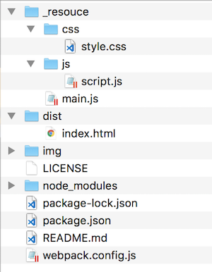

# mapboxgljs-starter


Start MapboxGLJS easily.  
- [MapboxGLJS v1.5.0](https://www.mapbox.com/mapbox-gl-js/api) 
- [webpack v4.39.1](https://webpack.js.org)  
- node v13.1.0
- npm v6.13.0

<br>

## Usage



<br>

Install package

```

npm install

```

<br>

build

```

npm run build

```

<br>

dev

```

npm run dev

```

---

<br>
<br>


<br>

## License
MIT

Copyright (c) 2019 Yasunori Kirimoto

<br>

---

<br>

### Japanese

<br>

# MapboxGLJS スターター


MapboxGLJSを手軽に始める
- [MapboxGLJS v1.5.0](https://www.mapbox.com/mapbox-gl-js/api) 
- [webpack v4.39.1](https://webpack.js.org)  
- node v13.1.0
- npm v6.13.0

<br>

##  使用方法


<br>

パッケージインストール

```

npm install

```

<br>

ビルド

```

npm run build

```

<br>

開発

```
npm run dev

```

<br>
<br>


<br>

## ライセンス
MIT

Copyright (c) 2019 Yasunori Kirimoto

<br>
